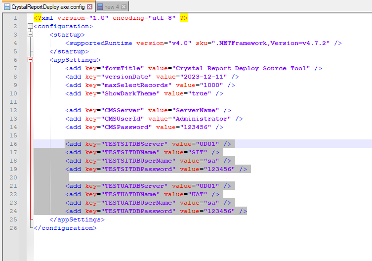

# crystal-report-batch-deployment
Use the .net SDK to batch upload and update the crystal report login information in the Crystal Report Server.

## Usage
### step 1 - Release souce code with x64 platform
### step 2 - Configuration in the App.config
